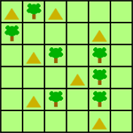

# Tents and Trees

A [Tents and Trees](https://www.reddit.com/r/IndieGaming/comments/93njyo/tents_trees_is_a_logic_puzzle_with_friendly/) generator and solver written in Racket.

## Game Overview

Tents and Trees is a logic puzzle played on a `grid` of `n*n` `cell`s. The game starts with some of the `cell`s populated by `tree`s. Each `column` and `row` are annotated with a non-negative number representing the number of `tent`s which must be placed in that column or row. A `tent` is placed in a `cell` by `fill`ing the `cell` with `grass`, and then `fill`ing the `grass` with a `tent`. A column or row is `complete` when all of its `cell`s are either `fill`ed with `grass` or `tent`s.

### Constraints

Several constraints makes the game challenging:

* A `tent` cannot be `adjacent` to any other `tent`. Adjacency in this regard covers **any** direction (horizontal, vertical, and diagonal).
* Each `tree` must have an `adjacent` `tent`. Adjacency in this regard covers **only** the horizontal and vertical directions.
* Each `tree` can **only** have a single `adjacent` `tent`.
* Each `column` and `row` must contain the specified number of `tent`s as annotated.

### Scoring

The score is based on the minimum number of moves (`fill`s) used to satisfy the constraints.
